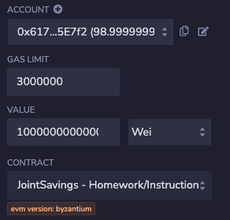

# Joint Savings Account Smart Contract

This project involves creating a Solidity smart contract to manage a joint savings account. The smart contract allows two users, represented by their Ethereum addresses, to control the joint savings account. It provides functionalities for depositing and withdrawing funds from the account.

## Smart Contract Overview
The smart contract is named `JointSavings`.

It contains the following variables:

- `accountOne and accountTwo`: Two variables of type `address payable` to represent the two joint account holders.

- `lastToWithdraw`: A variable of type `address public` to keep track of the last recipient who made a withdrawal.

- `lastWithdrawAmount`: A variable of type `uint public` to store the last withdrawal amount.

- `contractBalance`: A variable of type `uint public` to track the current balance of the joint savings account.

## Functionality
The smart contract provides the following functionalities:

1. **Withdraw:** The `withdraw` function allows a joint account holder to make a withdrawal from the account. The function takes two arguments: `amount` (uint) and `recipient` (payable address). It checks if the `recipient` is either `accountOne` or `accountTwo` using a `require` statement. It also ensures that the contract has sufficient funds for the withdrawal. If the `recipient` is different from the last recipient, the `lastToWithdraw` variable is updated. The function then transfers the specified `amount` to the `recipient`, updates `lastWithdrawAmount`, and refreshes `contractBalance`.

2. **Deposit:** The `deposit` function allows anyone to deposit funds into the joint savings account. It is a `public payable` function that increases the contract balance by the deposited amount.

3. **Set Accounts:** The `setAccounts` function is used to set the authorised Ethereum addresses (`accountOne` and `accountTwo`) that can withdraw funds from the joint savings account. It takes two `address payable` arguments: `account1` and `account2`. The function updates `accountOne` and `accountTwo` with the provided addresses.

## Interacting with the Smart Contract

1. **Deployment:** The smart contract is deployed on the Ethereum blockchain using Remix IDE's VM.

2. **Setting Joint Account Holders:** The `setAccounts` function is used to set the authorised Ethereum addresses (`accountOne` and `accountTwo`) for the joint savings account.

3. **Deposit:** The deposit functionality is tested by sending different amounts of ether (1 ether, 10 ether, and 5 ether) to the contract using the `deposit` function. The `contractBalance` function is used to verify that the funds were added to the account after each transaction.

4. **Withdrawal:** The withdrawal functionality is tested by making withdrawals of 5 ether to `accountOne` and 10 ether to `accountTwo`. The `contractBalance`, `lastToWithdraw`, and `lastWithdrawAmount` functions are used to verify that the funds were correctly withdrawn and updated in the contract.

## Execution Results
The results of the interactions with the smart contract, including deposit and withdrawal transactions, are captured in the `execution_results` folder.

The following screenshots from this folder confirm the successful execution of the JointSavings functionalities in the Remix IDE's VM.

**Deployment**

**Set Accounts**

 

**Deposit 1 ETH as WEI**

  

**Deposit 10 ETH as WEI**

  

**Deposit 5 ETH**

  

**Withdraw 5 ETH to accountOne**

**Withdraw 10 ETH to accountTwo**

**Terminal Output**

